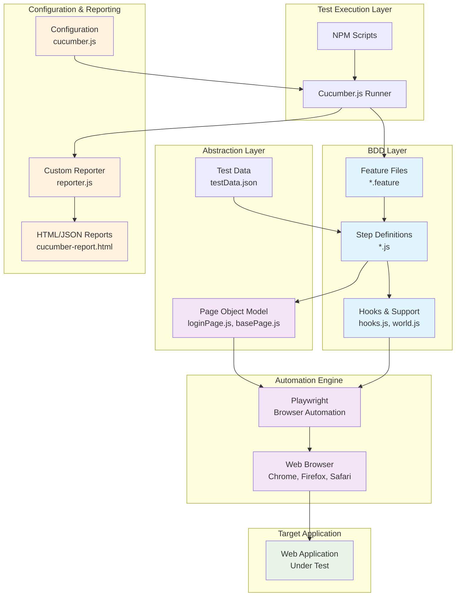

# 1BT Playwright BDD Automation Framework

>This project is a modern test automation framework using **Cucumber** (BDD) and **Playwright** with the **Page Object Model (POM)** in JavaScript. It enables scalable, maintainable, and readable frontend test automation for web applications.

---

## 🏗️ Architecture Diagram



---
## 📦 Project Structure

- `features/` — Cucumber feature files and step definitions
	- `step_definitions/` — Step implementations (JavaScript)
	- `support/` — Hooks and custom world logic
- `page_objects/` — Page Object Model classes for UI abstraction (e.g., `loginPage.js`)
- `test_data/` — Scenario data in JSON format
- `config/` — Cucumber and reporting configuration
- `reports/` — Generated test reports (HTML, JSON)
- `package.json` — Project dependencies and scripts

## 🚀 Getting Started

1. **Install dependencies:**
	 ```bash
	 npm install
	 ```
2. **Run all tests:**
	 ```bash
	 npx cucumber-js
	 ```
3. **Generate HTML report:**
	 ```bash
	 npm run test:report
	 # View the report at reports/cucumber-report.html
	 ```

## 🧩 Key Patterns & Conventions

- **Page Objects:**
	- Each UI page/component has a class in `page_objects/`.
	- All selectors and UI logic are encapsulated in these classes.
	- Example: `loginPage.js` exposes methods for login actions.
- **Step Definitions:**
	- Organized by feature in `features/step_definitions/`.
	- Use async/await for all steps.
	- Reuse steps where possible.
- **Test Data:**
	- Use `test_data/testData.json` for scenario-specific data.
	- Do **not** store credentials or secrets in the repo.
- **Hooks:**
	- Common setup/teardown logic in `features/support/hooks.js`.
- **Reporting:**
	- Custom reporting configured in `config/reporter.js`.
	- Reports output to `reports/cucumber-report.html`.

## ⚙️ Customization & Advanced Usage

- **Custom Cucumber config:** Edit `config/cucumber.js` for advanced options.
- **Add a new page:** Create a new file in `page_objects/` and expose UI methods.
- **Add a new test:** Create a `.feature` file in `features/` and implement steps in `step_definitions/`.

## 🛠️ Scripts

- `npm install` — Install dependencies
- `npx cucumber-js` — Run all tests
- `npm run test:report` — Run tests and generate HTML report

## 🤝 Contributing

Pull requests and issues are welcome! Please follow project conventions and keep tests maintainable.

---


