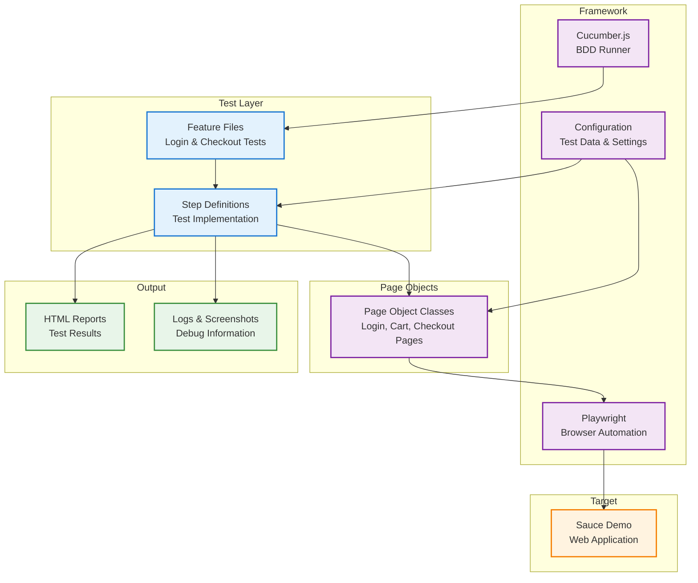

# 1BT Playwright BDD Automation Framework

>This project is a modern test automation framework using **Cucumber** (BDD) and **Playwright** with the **Page Object Model (POM)** in JavaScript. It enables scalable, maintainable, and readable frontend test automation for web applications.

---

## 🏗️ Architecture Diagram



---
## 📦 Project Structure

- `features/` — Cucumber feature files and step definitions
	- `sauceDemoLogin.feature` — Authentication testing scenarios
	- `sauceDemoCheckout.feature` — E-commerce checkout testing scenarios
	- `step_definitions/` — Step implementations (JavaScript)
		- `sauceDemoSteps.js` — Login and authentication steps
		- `sauceDemoCheckoutSteps.js` — Checkout and cart management steps
	- `support/` — Hooks and custom world logic
- `page_objects/` — Page Object Model classes for UI abstraction
	- `basePage.js` — Base page with common functionality
	- `sauceDemoLoginPage.js` — Login page interactions
	- `sauceDemoInventoryPage.js` — Product inventory and cart management
	- `sauceDemoCartPage.js` — Shopping cart operations
	- `sauceDemoCheckoutPage.js` — Checkout information form
	- `sauceDemoCheckoutOverviewPage.js` — Order review and summary
	- `sauceDemoCheckoutCompletePage.js` — Order completion confirmation
- `test_data/` — Scenario data in JSON format
	- `testData.json` — User credentials, product data, and checkout information
- `config/` — Cucumber, reporting, and logging configuration
- `reports/` — Generated test reports (HTML, JSON)
- `logs/` — Application and test execution logs (auto-rotating)
- `utils/` — Utility classes and helpers (Logger, etc.)
- `docs/` — Documentation and guides
- `package.json` — Project dependencies and scripts

## 🚀 Getting Started

1. **Install dependencies:**
	 ```bash
	 npm install
	 ```
2. **Run all tests:**
	 ```bash
	 npx cucumber-js
	 ```
3. **Run specific feature tests:**
	 ```bash
	 # Login tests only
	 npx cucumber-js features/sauceDemoLogin.feature
	 
	 # Checkout tests only
	 npx cucumber-js features/sauceDemoCheckout.feature
	 
	 # Run specific scenario
	 npx cucumber-js --name="Complete full checkout process"
	 ```
4. **Generate HTML report:**
	 ```bash
	 npm run test:report
	 # View the report at reports/cucumber-report.html
	 ```

## 🧩 Key Patterns & Conventions

- **Page Objects:**
	- Each UI page/component has a class in `page_objects/`.
	- All selectors and UI logic are encapsulated in these classes.
	- Example: `sauceDemoLoginPage.js` exposes methods for login actions, `sauceDemoCartPage.js` handles cart operations.
- **Step Definitions:**
	- Organized by feature in `features/step_definitions/`.
	- Use async/await for all steps.
	- Reuse steps where possible across different features.
- **Test Data:**
	- Use `test_data/testData.json` for scenario-specific data.
	- Includes user credentials, product information, and checkout data.
	- Do **not** store credentials or secrets in the repo.
- **Hooks:**
	- Common setup/teardown logic in `features/support/hooks.js`.
- **Reporting:**
	- Custom reporting configured in `config/reporter.js`.
	- Reports output to `reports/cucumber-report.html`.
- **Logging:**
	- Comprehensive logging with Winston in `config/logger.js`.
	- Structured logs for tests, page actions, and system events.
	- Daily rotating logs in `logs/` directory.
	- See `docs/Logging_Guide.md` for detailed usage.

## ⚙️ Customization & Advanced Usage

- **Custom Cucumber config:** Edit `config/cucumber.js` for advanced options.
- **Add a new page:** Create a new file in `page_objects/` and expose UI methods.
- **Add a new test:** Create a `.feature` file in `features/` and implement steps in `step_definitions/`.

## 🛠️ Scripts

- `npm install` — Install dependencies
- `npx cucumber-js` — Run all tests
- `npm run test:report` — Run tests and generate HTML report
- `npm run test:login` — Run login feature tests only
- `npm run test:checkout` — Run checkout feature tests only
- `npm run view-report` — Open the latest HTML report
- `npm run clean-screenshots` — Clean screenshot directory

## 🧪 Test Features

This framework includes comprehensive test coverage for the Sauce Demo application:

### 🔐 Authentication Testing (`sauceDemoLogin.feature`)
- **Successful login** with valid credentials
- **Failed login** scenarios (invalid credentials, locked users)
- **Error message validation** for authentication failures

### 🛒 E-commerce Checkout Testing (`sauceDemoCheckout.feature`)
- **Cart Management:**
  - Add single/multiple products to cart
  - Remove products from cart
  - Cart badge validation and visibility
  - View cart details and navigate between pages
- **Checkout Process:**
  - Complete end-to-end checkout workflow
  - Checkout information validation (required fields)
  - Order review and confirmation
  - Success page validation
- **Navigation Flow:**
  - Continue shopping from cart
  - Cancel checkout at different stages
- **Data-Driven Testing:**
  - Scenario outlines for testing multiple product types
  - Comprehensive product catalog coverage

**Total Coverage:** 19+ scenarios, 112+ test steps

## 📊 Features

### ✅ Comprehensive Logging
- **Multi-level logging** (DEBUG, INFO, WARN, ERROR)
- **Daily rotating log files** with automatic archival
- **Structured logging** for better analysis and debugging
- **Performance tracking** and metrics
- **Test execution tracing** with detailed step logging
- **Error tracking** with stack traces and context

### ✅ Advanced Reporting
- **HTML reports** with test results and screenshots
- **JSON reports** for CI/CD integration
- **Screenshot capture** on test failures
- **Custom reporting** with configurable options

### ✅ Robust Test Architecture
- **Page Object Model** for maintainable UI interactions
- **BDD approach** with Cucumber and Gherkin syntax
- **Data-driven testing** with JSON test data
- **Cross-browser testing** capability with Playwright
- **Hooks and fixtures** for setup/teardown operations

## 🤝 Contributing

Pull requests and issues are welcome! Please follow project conventions and keep tests maintainable.

## 📝 Recent Updates

### v1.1.0 - September 2025
- ✅ **Added comprehensive checkout testing** with `sauceDemoCheckout.feature`
- ✅ **16 new test scenarios** covering complete e-commerce workflow
- ✅ **4 new page objects** for cart, checkout, and order management
- ✅ **Enhanced inventory page** with cart functionality
- ✅ **Updated test data** with product catalog and checkout information
- ✅ **Added npm script** for running checkout tests independently (`npm run test:checkout`)
- ✅ **Expanded documentation** with detailed feature coverage

---


