# 🏗️ 1BTFEAutomation Framework - Simple Architecture Diagram

## 📐 **Clean & Simple Architecture Overview**

```mermaid
graph TB
    subgraph "🎯 BDD Test Layer"
        A[📝 Feature Files<br/>(.feature)]
        B[📊 Test Data<br/>(JSON)]
    end
    
    subgraph "🔗 Execution Engine"
        C[⚙️ Cucumber.js<br/>Test Runner]
        D[🎭 Step Definitions<br/>(Given-When-Then)]
    end
    
    subgraph "🏛️ Page Layer"
        E[📄 Base Page<br/>(Common Methods)]
        F[🔐 Login Page]
        G[🛒 Cart Pages]
        H[✅ Checkout Pages]
    end
    
    subgraph "🤖 Automation Engine"
        I[🎭 Playwright<br/>Browser Driver]
        J[🌐 Chrome Browser]
    end
    
    subgraph "📊 Output & Monitoring"
        K[📈 HTML Reports]
        L[📝 Winston Logs]
        M[📸 Screenshots]
    end
    
    A --> C
    B --> D
    C --> D
    D --> E
    E --> F
    E --> G
    E --> H
    F --> I
    G --> I
    H --> I
    I --> J
    C --> K
    D --> L
    I --> M
    
    classDef bdd fill:#e3f2fd,stroke:#1976d2,stroke-width:3px
    classDef execution fill:#f3e5f5,stroke:#7b1fa2,stroke-width:3px
    classDef pages fill:#e8f5e8,stroke:#388e3c,stroke-width:3px
    classDef automation fill:#fff3e0,stroke:#f57c00,stroke-width:3px
    classDef output fill:#fce4ec,stroke:#c2185b,stroke-width:3px
    
    class A,B bdd
    class C,D execution
    class E,F,G,H pages
    class I,J automation
    class K,L,M output
```

## 🎨 **Simplified Visual Flow**

```
┌─────────────────────────────────────────────────────────────┐
│                    📝 WRITE TESTS                           │
│   ┌─────────────┐     ┌─────────────┐     ┌─────────────┐   │
│   │   Feature   │────▶│ Test Data   │────▶│  Scenarios  │   │
│   │   Files     │     │   (JSON)    │     │ (Gherkin)   │   │
│   └─────────────┘     └─────────────┘     └─────────────┘   │
└─────────────────────────────────────────────────────────────┘
                                │
                                ▼
┌─────────────────────────────────────────────────────────────┐
│                   ⚙️ EXECUTE TESTS                          │
│   ┌─────────────┐     ┌─────────────┐     ┌─────────────┐   │
│   │ Cucumber.js │────▶│    Step     │────▶│   Page      │   │
│   │  Runner     │     │ Definitions │     │  Objects    │   │
│   └─────────────┘     └─────────────┘     └─────────────┘   │
└─────────────────────────────────────────────────────────────┘
                                │
                                ▼
┌─────────────────────────────────────────────────────────────┐
│                  🎭 BROWSER AUTOMATION                      │
│   ┌─────────────┐     ┌─────────────┐     ┌─────────────┐   │
│   │ Playwright  │────▶│   Chrome    │────▶│  Website    │   │
│   │   Driver    │     │  Browser    │     │  Actions    │   │
│   └─────────────┘     └─────────────┘     └─────────────┘   │
└─────────────────────────────────────────────────────────────┘
                                │
                                ▼
┌─────────────────────────────────────────────────────────────┐
│                   📊 GENERATE RESULTS                       │
│   ┌─────────────┐     ┌─────────────┐     ┌─────────────┐   │
│   │    HTML     │     │   Winston   │     │ Screenshots │   │
│   │   Reports   │     │    Logs     │     │ (on failure)│   │
│   └─────────────┘     └─────────────┘     └─────────────┘   │
└─────────────────────────────────────────────────────────────┘
```

## 🎯 **Core Components Explained**

### **📝 BDD Layer** (What we test)
- **Feature Files**: Human-readable test scenarios
- **Test Data**: Configuration and test inputs

### **⚙️ Execution Layer** (How we run tests)
- **Cucumber.js**: Orchestrates test execution
- **Step Definitions**: Translates Gherkin to code

### **🏛️ Page Layer** (What we interact with)
- **Base Page**: Common functionality for all pages
- **Page Objects**: Specific page interactions (Login, Cart, Checkout)

### **🎭 Automation Layer** (How we control browser)
- **Playwright**: Modern browser automation
- **Chrome**: Target browser for testing

### **📊 Output Layer** (What we get)
- **Reports**: HTML test results
- **Logs**: Detailed execution information  
- **Screenshots**: Visual failure documentation

---

## 🔄 **Simple Data Flow**

```mermaid
flowchart LR
    A[🎯 Feature] --> B[⚙️ Cucumber]
    B --> C[🎭 Step Def]
    C --> D[🏛️ Page Object]
    D --> E[🤖 Playwright]
    E --> F[🌐 Browser]
    F --> G[📊 Results]
    
    classDef node fill:#e3f2fd,stroke:#1976d2,stroke-width:2px
    class A,B,C,D,E,F,G node
```



## 📋 **Architecture Highlights**

| Layer | Technology | Purpose |
|-------|------------|---------|
| **🎯 BDD** | Cucumber.js + Gherkin | Define test scenarios in plain English |
| **🔗 Execution** | JavaScript ES6+ | Execute test logic and orchestration |
| **🏛️ Pages** | Page Object Model | Encapsulate page interactions and elements |
| **🤖 Automation** | Playwright | Control browser and perform actions |
| **📊 Monitoring** | Winston + HTML Reports | Track execution and generate results |

---

## 🌟 **Key Architectural Strengths**

✅ **Clean Separation**: Each layer has a single responsibility  
✅ **Easy to Understand**: Clear flow from test to execution to results  
✅ **Maintainable**: Changes in one layer don't affect others  
✅ **Scalable**: Easy to add new pages, tests, or browsers  
✅ **Professional**: Industry-standard patterns and tools  

---

## 🎨 **Visual Summary**

```
    📝 Write Tests (Gherkin)
         ⬇️
    ⚙️ Run Tests (Cucumber)  
         ⬇️
    🏛️ Interact with Pages (POM)
         ⬇️
    🤖 Control Browser (Playwright)
         ⬇️
    📊 Generate Reports (HTML + Logs)
```

**This architecture follows the golden rule: "Simple to understand, powerful to execute!"** 🏆