# 🏗️ 1BTFEAutomation Framework - Technology Stack Diagram

## 📊 Complete Technology Stack Architecture

```mermaid
graph TB
    subgraph "🎯 Testing Layer"
        A[BDD/Gherkin Features]
        B[Cucumber.js v9.6.0]
        C[Step Definitions]
        D[Test Hooks & Support]
    end
    
    subgraph "🎭 Browser Automation Layer"
        E[Playwright v1.55.0]
        F[Chromium Engine]
        G[Cross-Browser Support]
        H[Element Interactions]
    end
    
    subgraph "🏛️ Architecture Layer"
        I[Page Object Model]
        J[Base Page Pattern]
        K[Page Classes]
        L[Element Locators]
    end
    
    subgraph "📊 Data & Configuration"
        M[Test Data JSON]
        N[Configuration Files]
        O[Environment Settings]
        P[Cucumber Config]
    end
    
    subgraph "📝 Logging & Monitoring"
        Q[Winston Logger v3.11.0]
        R[Daily Rotate Files v4.7.1]
        S[Multiple Log Levels]
        T[Structured Logging]
    end
    
    subgraph "📈 Reporting Layer"
        U[Cucumber HTML Reporter v7.2.0]
        V[JSON Reports]
        W[HTML Reports]
        X[Screenshot Capture]
    end
    
    subgraph "⚙️ Runtime Environment"
        Y[Node.js Runtime]
        Z[NPM Package Manager]
        AA[JavaScript ES6+]
        BB[Async/Await]
    end
    
    subgraph "🔧 Development Tools"
        CC[Git Version Control]
        DD[VS Code/IDE]
        EE[PowerShell Scripts]
        FF[NPM Scripts]
    end
    
    A --> B
    B --> C
    C --> D
    B --> E
    E --> F
    E --> G
    E --> H
    C --> I
    I --> J
    J --> K
    K --> L
    M --> C
    N --> B
    O --> E
    P --> B
    C --> Q
    I --> Q
    Q --> R
    Q --> S
    Q --> T
    B --> U
    U --> V
    U --> W
    E --> X
    B --> Y
    Y --> Z
    Y --> AA
    AA --> BB
    Y --> CC
    CC --> DD
    FF --> EE
    Z --> FF
    
    classDef testing fill:#e1f5fe,stroke:#01579b,stroke-width:2px
    classDef automation fill:#f3e5f5,stroke:#4a148c,stroke-width:2px
    classDef architecture fill:#e8f5e8,stroke:#1b5e20,stroke-width:2px
    classDef data fill:#fff3e0,stroke:#e65100,stroke-width:2px
    classDef logging fill:#fce4ec,stroke:#880e4f,stroke-width:2px
    classDef reporting fill:#f1f8e9,stroke:#33691e,stroke-width:2px
    classDef runtime fill:#e3f2fd,stroke:#0d47a1,stroke-width:2px
    classDef tools fill:#f9fbe7,stroke:#827717,stroke-width:2px
    
    class A,B,C,D testing
    class E,F,G,H automation
    class I,J,K,L architecture
    class M,N,O,P data
    class Q,R,S,T logging
    class U,V,W,X reporting
    class Y,Z,AA,BB runtime
    class CC,DD,EE,FF tools
```



## 🔧 Technology Stack Breakdown

### 🎯 **Core Testing Technologies**
| Technology | Version | Purpose |
|------------|---------|---------|
| **Cucumber.js** | v9.6.0 | BDD test framework and Gherkin parser |
| **Gherkin** | Latest | Human-readable test specification language |
| **Playwright** | v1.55.0 | Modern browser automation library |
| **@playwright/test** | v1.55.0 | Playwright test runner and assertions |

### 🏛️ **Architecture & Design Patterns**
- **Page Object Model (POM)** - Encapsulation of page elements and actions
- **Base Page Pattern** - Common functionality inheritance
- **Dependency Injection** - Clean separation of concerns
- **Factory Pattern** - Dynamic page object creation

### 📊 **Data Management & Configuration**
- **JSON Test Data** - External test data management
- **Environment Configuration** - Multi-environment support
- **Cucumber Configuration** - Test execution parameters
- **Dynamic Data Binding** - Runtime data injection

### 📝 **Logging & Observability**
| Component | Technology | Features |
|-----------|------------|----------|
| **Logger** | Winston v3.11.0 | Structured logging with multiple transports |
| **Log Rotation** | winston-daily-rotate-file v4.7.1 | Daily log rotation with retention |
| **Log Levels** | Debug, Info, Warn, Error | Hierarchical logging levels |
| **Specialized Loggers** | Page, Step, Test loggers | Context-specific logging |

### 📈 **Reporting & Analytics**
- **HTML Reports** - cucumber-html-reporter v7.2.0
- **JSON Reports** - Machine-readable test results
- **Screenshot Capture** - Visual failure documentation
- **Test Metrics** - Duration, pass/fail statistics

### ⚙️ **Runtime Environment**
- **Node.js** - JavaScript runtime environment
- **ES6+ JavaScript** - Modern JavaScript features
- **NPM** - Package and dependency management
- **Async/Await** - Modern asynchronous programming

### 🔧 **Development & DevOps Tools**
- **Git** - Version control system
- **PowerShell** - Windows automation scripts
- **NPM Scripts** - Build and test automation
- **VS Code** - Development environment

## 🏗️ **Architectural Layers Diagram**

```
┌─────────────────────────────────────────────────────────────┐
│                    🎯 BDD Test Layer                        │
│  ┌─────────────┐  ┌─────────────┐  ┌─────────────┐         │
│  │   Features  │  │ Scenarios   │  │  Examples   │         │
│  │  (.feature) │  │ (Gherkin)   │  │ (Test Data) │         │
│  └─────────────┘  └─────────────┘  └─────────────┘         │
└─────────────────────────────────────────────────────────────┘
                                │
                                ▼
┌─────────────────────────────────────────────────────────────┐
│                  🔗 Step Definitions Layer                  │
│  ┌─────────────┐  ┌─────────────┐  ┌─────────────┐         │
│  │   Given     │  │    When     │  │    Then     │         │
│  │ (Setup)     │  │ (Actions)   │  │ (Assertions)│         │
│  └─────────────┘  └─────────────┘  └─────────────┘         │
└─────────────────────────────────────────────────────────────┘
                                │
                                ▼
┌─────────────────────────────────────────────────────────────┐
│                🏛️ Page Object Model Layer                   │
│  ┌─────────────┐  ┌─────────────┐  ┌─────────────┐         │
│  │  Base Page  │  │ Login Page  │  │ Inventory   │         │
│  │  (Common)   │  │   (Auth)    │  │   (Shop)    │         │
│  └─────────────┘  └─────────────┘  └─────────────┘         │
└─────────────────────────────────────────────────────────────┘
                                │
                                ▼
┌─────────────────────────────────────────────────────────────┐
│                🎭 Browser Automation Layer                  │
│  ┌─────────────┐  ┌─────────────┐  ┌─────────────┐         │
│  │ Playwright  │  │  Chromium   │  │  WebDriver  │         │
│  │ (Driver)    │  │ (Browser)   │  │ (Protocol)  │         │
│  └─────────────┘  └─────────────┘  └─────────────┘         │
└─────────────────────────────────────────────────────────────┘
```

## 🔄 **Data Flow Architecture**

```
Test Execution → Cucumber Runner → Step Definitions → Page Objects → Playwright → Browser
      ↓                ↓               ↓               ↓           ↓         ↓
   Logging ←──── Winston Logger ←── Action Logs ←── Page Logs ←── Events ←── DOM
      ↓                ↓               ↓               ↓           ↓         ↓
   Reports ←──── HTML Reporter ←── JSON Results ←── Test Status ←── Results ← Response
```

## 📋 **Key Technology Decisions & Rationale**

### ✅ **Excellent Choices**
1. **Cucumber.js** - Industry standard for BDD, excellent Gherkin support
2. **Playwright** - Modern, fast, reliable browser automation
3. **Winston** - Enterprise-grade logging with excellent configuration
4. **Page Object Model** - Maintainable, scalable test architecture

### 🔄 **Potential Enhancements**
1. **TypeScript** - Type safety and better IDE support
2. **Docker** - Containerized test execution
3. **CI/CD Pipeline** - Automated test execution
4. **Allure Reports** - Advanced test reporting

## 🏆 **Technology Stack Rating**

| Category | Rating | Justification |
|----------|--------|---------------|
| **Framework Choice** | 9.5/10 | Modern, industry-standard technologies |
| **Architecture** | 9.0/10 | Clean separation, maintainable design |
| **Tooling** | 8.5/10 | Comprehensive logging, good reporting |
| **Scalability** | 8.0/10 | Well-structured for growth |
| **Maintainability** | 8.8/10 | Clear patterns, good documentation |

**Overall Technology Stack Score: 8.8/10** 🏆

Your framework uses a **modern, well-architected technology stack** that follows industry best practices and provides excellent foundation for scalable test automation!